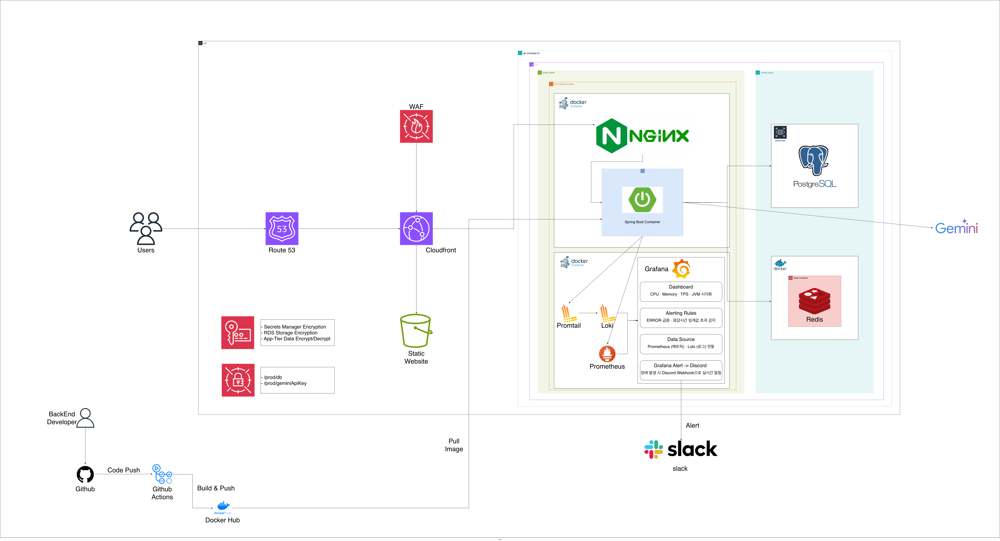

# ✈️ Trip Agent - AI 기반 출장 자동화 플랫폼

> 출장 예약부터 정산까지, 에이전트가 대신합니다.

## 📌 프로젝트 소개

**Trip Agent**는 Browser-Use 오픈소스를 활용한 **AI 기반 출장 자동화 서비스**입니다.

출장 예약부터 경비 정산까지, 기업의 출장 업무를 하나의 플랫폼에서 처리합니다.
- 🤖 **기업 담당자**에게는 반복적인 출장 업무를 자동화하는 AI 에이전트를
- 👔 **출장자**에게는 예약부터 정산까지 한 번에 처리하는 통합 경험을

제공합니다.

## 🔍 핵심 기능

| 기능 | 설명 |
|------|------|
| 🤖 **AI 자동 예약** | 출장 정보 입력 시 AI 에이전트가 항공편 · 숙박 자동 예약 |
| 🏨 **숙소 조회** | 아고다 파트너십 API 기반 전 세계 숙소 지역별 조회 |
| 🧾 **영수증 관리** | 영수증 이미지 업로드 시 OCR 자동 추출 · S3 + CloudFront 기반 관리 |
| 📊 **워크스페이스 연동** | 예약 결과 Slack · Notion 자동 등록 |
| 🔐 **보안 관리** | AWS KMS 기반 민감 정보 암호화 저장 |

## 🚀 Backend Tech Stack

### 🧩 Framework & Language


### 🔐 Security & Authentication


### 🗄 Database


### ☁️ Infrastructure & DevOps


### 📊 Monitoring & Logging


### 📚 Libraries & Tools


## 📁 패키지 구조

Trip Agent 백엔드는 **도메인 주도 설계(DDD) 아키텍처**를 채택하여 비즈니스 로직과 인프라를 명확히 분리하고 유지보수성을 극대화합니다.  
모든 도메인 패키지는 `application` · `domain` · `infrastructure` · `presentation` 네 가지 레이어로 구성되며, 각 레이어는 단일 책임 원칙을 따릅니다.  
또한 `application` · `presentation` 레이어에 **CQS(Command Query Separation) 패턴**을 적용하여 상태 변경(Command)과 조회(Query)의 책임을 명확히 분리했습니다.
```
mjk-agent
├── domain
│   └── member                        # 👤 회원 도메인 
│       ├── application               # 비즈니스 로직, 트랜잭션 시작점
│       │   ├── command               # 상태 변경 요청 처리 (CQS - Command)
│       │   │   └── MemberCommandService
│       │   ├── dto                   # 데이터 전달 객체
│       │   └── query                 # 조회 요청 처리 (CQS - Query)
│       │       └── MemberQueryService
│       ├── domain                    # 핵심 도메인 객체 · 인터페이스 정의
│       │   ├── Member                # 도메인 객체
│       │   └── MemberRepository      # 도메인 인터페이스
│       ├── infrastructure            # DB 연동, Repository 구현
│       │   ├── MemberJpaRepository
│       │   └── MemberRepositoryImpl
│       └── presentation              # 요청 · 응답 처리
│           ├── command               # 쓰기 API (CQS - Command)
│           │   └── MemberCommandController
│           ├── query                 # 읽기 API (CQS - Query)
│           │   └── MemberQueryController
│           └── request               # 요청 DTO
│
└── global                            # 전역 공통 모듈
    ├── auth                          # Google OAuth2 인증
    ├── jwt                           # 토큰 발급 · 검증
    ├── config                        # Spring 설정
    ├── exception                     # 전역 예외 처리
    ├── kms                           # AWS KMS 암호화
    └── ...
```

## 🏗️ 시스템 아키텍처

<p align="center">
  
</p>

> **Route 53 · CloudFront · Nginx Reverse Proxy · Docker Compose 모듈화 · Grafana 모니터링** 구조로  
> 안정적인 서비스 운영과 확장성을 확보했습니다.

---

### 🌐 서비스 구성

| 컴포넌트 | 역할 |
|---|---|
| **Route 53** | DNS 라우팅 · 도메인 관리 (mjk.ai.kr) |
| **CloudFront** | CDN · HTTPS · BE 요청을 Nginx로 포워딩 |
| **Static Website (S3)** | 프론트엔드 정적 파일 서빙 · CloudFront Origin |
| **Nginx** | Reverse Proxy · SSL/TLS · Rate Limiting · Cross-Domain Cookie 해결 |
| **Spring Boot (Docker)** | 단일 컨테이너 · AI Agent · Actuator · AOP Logger |
| **PostgreSQL (AWS RDS)** | 서비스 주요 데이터 · Private Subnet |
| **Redis** | 세션 · 인증 토큰 · TTL 자동 만료 |
| **Gemini API** | AI 에이전트 LLM 연동 |

---

### 🔄 사용자 요청 흐름

```
User → Route 53 → CloudFront → Nginx → Spring Boot → PostgreSQL(RDS) · Redis
                      ↓
               Static Website (S3)  ·  FE 정적 파일 서빙
```

### 🚀 CI/CD 배포 흐름

```
Code Push
    ↓
GitHub Actions  →  Docker Hub (Build & Push)
    ↓
EC2 SSH 접속  →  Docker Image Pull
    ↓
Docker Compose 재배포
    ↓
Discord Webhook 알림
```

### 🐳 Docker Compose 구성

```
docker-compose-service.yml
├── nginx                  # Reverse Proxy · SSL/TLS · Rate Limiting
└── app                    # Spring Boot 단일 컨테이너 

docker-compose-infra.yml
└── redis                  # 세션 · TTL 자동 만료

docker-compose-monitoring.yml
├── promtail               # 로그 파일 수집 · 태깅
├── loki                   # 로그 집계 · 인덱싱
├── prometheus             # 메트릭 수집 · 15s interval
└── grafana                # 대시보드 · 알림 · :3000
```

### 📊 모니터링 구성

> **Docker Compose 기반 모니터링 스택**을 별도로 구성하여 서비스 상태를 실시간으로 관찰합니다.

| 컴포넌트 | 역할 |
|---|---|
| **Promtail** | 애플리케이션 로그 파일 수집 및 태깅 |
| **Loki** | 수집된 로그 집계 및 인덱싱 |
| **Prometheus** | Spring Boot Actuator에서 메트릭 수집 (15s 간격) |
| **Grafana** | 메트릭 · 로그 통합 대시보드 시각화 (CPU · Memory · TPS · JVM) |
| **Discord Webhook** | Grafana Alert 기반 장애 · 에러 실시간 알림 |

## 👥 팀원

<table>
  <tr>
    <td align="center">
      <a href="https://github.com/squatboy">
        
        <br/>
        <sub><b>이재영</b></sub>
      </a>
      <br/>
      <sub>Frontend Lead · Infra · AI Agent</sub>
      <br/>
    </td>
    <td align="center">
      <a href="https://github.com/y22jun">
        
        <br/>
        <sub><b>신예준</b></sub>
      </a>
      <br/>
      <sub>Backend Lead · Infra · AI Agent</sub>
      <br/>
    </td>
    <td align="center">
      <a href="https://github.com/myeongjaeking">
        
        <br/>
        <sub><b>최명재</b></sub>
      </a>
      <br/>
      <sub>CEO · Backend · AI Agent</sub>
      <br/>
    </td>
  </tr>
</table>